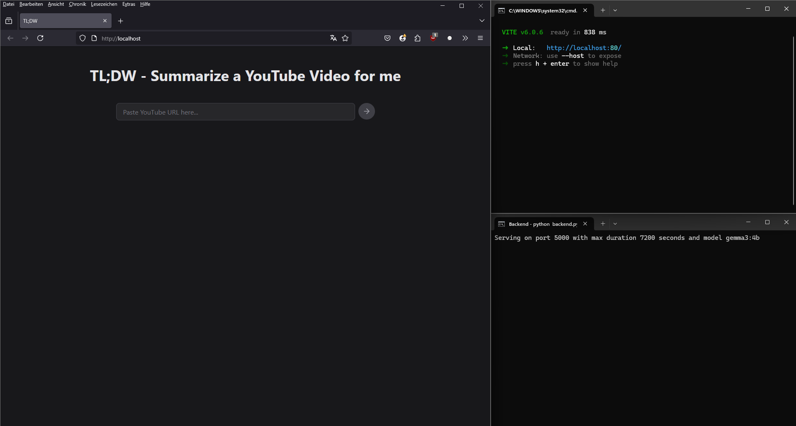

# TL;DW

Too Long; Didn't Watch!
Forked from [here](https://github.com/stong/tldw).

I wanted to  
- run this under Windows
- adapt it to run using `ollama`
- be able to ask follow up questions

This is the start page running on a local gemma3:4b model served by ollama:

This is what the summary followed by a question looks like:

# Build (under Windows)

### Backend
- Preliminaries:
    - Of course you need Python (I use [miniconda](https://www.anaconda.com/docs/getting-started/miniconda/install)) and [ollama](https://ollama.com/) to be installed and running...
    - `ollama` needs to serve a model, I use by default gemma3:4b (`ollama pull gemma3:4b`), but you can change it in the `.env` file
- Set up the Python script:
    - `python -m venv venv`
    - `.\venv\Scripts\activate.bat`
    - `pip install -r requirements.txt`

### Frontend
- Preliminaries:
    - get [node.js with npm](https://nodejs.org/en/download/)
    - install yarn: `npm i -g yarn`
    - ## install react-markdown `npm install react-markdown@latest`
- Set up the frontend script
    - `cd youtube-summarizer`
    - `yarn install`

# Run
After installing everthing, you can either **double-click the `tldw.bat` script** (adapt paths to your computer) to start front- and backend.

Or you can run them from terminal individually:

### Backend
- `.\venv\Scripts\activate.bat`
- `python backend.py --model llama3.2:latest`
- if you change the port from its default 5000, you will need to adapt the port accordingly in the src/App.tsx file.

### Frontend
- `cd youtube-summarizer`
- `yarn dev --port 80` (without port, the default is pot 5173)
- Go to `http://localhost`

### Updating

- Open `CMD` (not CMDR!)
- Go to the directory: `cd C:\Users\danie\Desktop\Code\tldw`
- Activate the venv: `.\venv\Scripts\activate.bat`
- Update the youtube downloader: `pip install --upgrade yt-dlp`
- Update the webvtt package: `pip install --upgrade webvtt-py`
